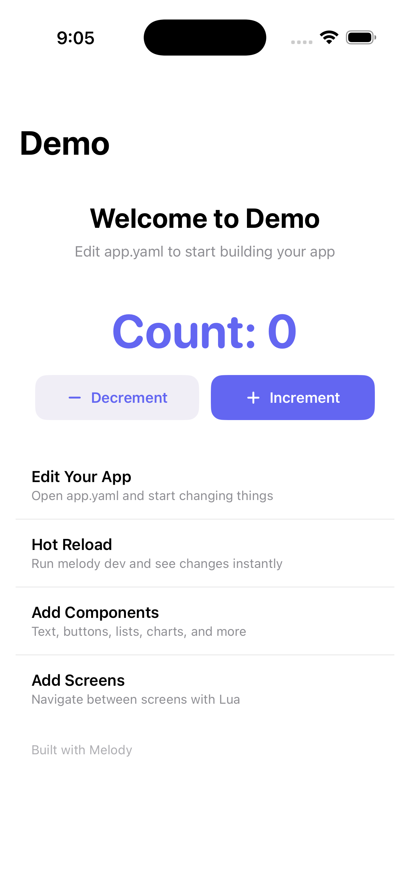

# Getting Started

Get a Melody app running on your machine in under 5 minutes.

## Install the CLI

```bash
git clone https://github.com/aspect-build/melody.git
cd melody
swift build -c release
cp .build/release/melody /usr/local/bin/
```

Verify it's working:

```bash
melody --help
```

## Create a project

```bash
melody create MyApp
cd MyApp
```

This generates everything you need:

```
MyApp/
  app.yaml               # Your app
  screens/                # Screen files
  components/             # Reusable components
  assets/                 # Images and static files
  MyApp.xcodeproj/        # Xcode project (ready to build)
  android/                # Android project
```

## Run it

Open the Xcode project and hit Run:

```bash
open MyApp.xcodeproj
```

You should see a screen with a counter button. That's your starter app — defined entirely in `app.yaml`.

## Start the dev server

In a separate terminal, start hot reload:

```bash
melody dev
```

Now edit `app.yaml`, save, and watch the app update instantly. No rebuild, no recompile.



You can also target a specific platform:

```bash
melody dev --platform ios --simulator "iPhone 16 Pro"
melody dev --platform macos
melody dev --platform ios --device
melody dev --platform android
```

## Your first edit

Open `app.yaml`.

Try changing the title text to something else, save, and watch it update live.


## Validate your YAML

If something looks wrong, run the validator:

```bash
melody validate
```

It'll catch missing fields, duplicate IDs, and common mistakes before you hit runtime.

## Next steps

- [Tutorial: Build a Notes App](./tutorial.md) — build something real from scratch
- [Core Concepts](./guides/core-concepts.md) — understand YAML structure, state, and expressions
- [Components](./guides/components.md) — the full component toolkit with examples
- [Navigation](./guides/navigation.md) — screens, tabs, sheets, and routing
- [Theming](./guides/theming.md) — colors, dark mode, and adaptive themes
- [Plugins](./guides/plugins.md) — extend Melody with native code
