# Components Guide

A visual reference for every built-in component in Melody.

## Text

Display static or dynamic text.

```yaml
- component: text
  text: "{{ state.title }}"
  style:
    fontSize: 24
    fontWeight: bold
    color: "theme.textPrimary"
    lineLimit: 2
```

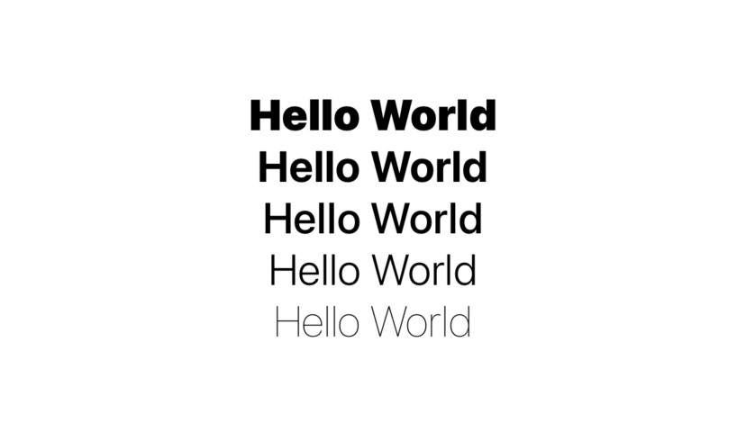

Font weights: `ultraLight`, `thin`, `light`, `regular`, `medium`, `semibold`, `bold`, `heavy`, `black`.

Font designs: `default`, `monospaced`, `rounded`, `serif`.

## Button

Tappable action with a label and optional icon.

```yaml
- component: button
  label: Save
  systemImage: checkmark
  onTap: "saveData()"
  style:
    fontSize: 17
    fontWeight: semibold
    color: "#ffffff"
    backgroundColor: "theme.primary"
    padding: 16
    borderRadius: 14
```

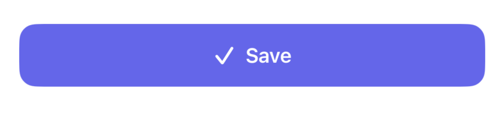

When `backgroundColor` is set, the button expands to full width.

## Stack

Layout container. Controls direction, spacing, and alignment of children.

```yaml
- component: stack
  direction: horizontal    # vertical (default), horizontal, z
  style:
    spacing: 12
    alignment: center
    padding: 16
  children:
    - component: image
      systemImage: star.fill
    - component: text
      text: Favorited
    - component: spacer
    - component: image
      systemImage: chevron.right
```

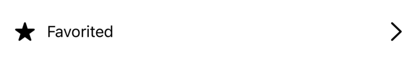

Stacks are the main layout tool. Nest them to build any layout.

## Image

SF Symbols or remote images.

```yaml
# SF Symbol
- component: image
  systemImage: heart.fill
  style:
    width: 32
    height: 32
    color: "theme.primary"

# Remote image
- component: image
  src: "{{ state.user.avatarUrl }}"
  style:
    width: 64
    height: 64
    borderRadius: 32
    contentMode: fill
```


`contentMode`: `fit` (default) or `fill`.

## Input

Text fields, secure fields, and text areas.

```yaml
# Text field
- component: input
  placeholder: Email address
  inputType: email
  stateKey: email
  style:
    padding: 12
    backgroundColor: "theme.surface"
    borderRadius: 10

# Password
- component: input
  placeholder: Password
  inputType: password
  stateKey: password

# Multi-line text area
- component: input
  placeholder: Write something...
  inputType: textarea
  stateKey: content
  style:
    minHeight: 150
    padding: 12
```

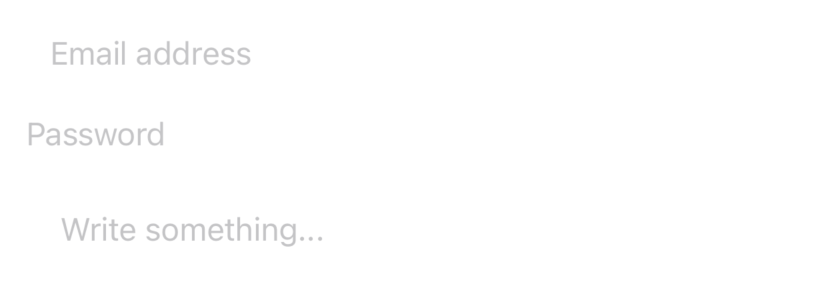

Input types: `text`, `email`, `url`, `number`, `phone`, `password`, `search`, `textarea`.

Use `stateKey` to bind to state, or `value` + `onChanged` for manual control.

## Toggle

Boolean switch bound to state.

```yaml
- component: toggle
  label: Dark Mode
  stateKey: darkMode
```

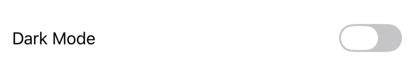

## Picker

Selection control — segmented, wheel, or dropdown menu.

```yaml
- component: picker
  label: Sort by
  stateKey: sortOrder
  pickerStyle: segmented
  options:
    - { label: Recent, value: recent }
    - { label: Name, value: name }
    - { label: Size, value: size }
```

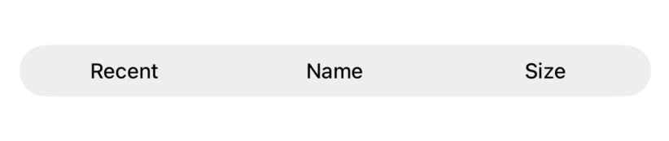

Styles: `segmented`, `menu` (default), `wheel`.

Options can also be dynamic: `options: "state.availableOptions"`.

## DatePicker

Date and time selection.

```yaml
- component: datepicker
  label: Due date
  stateKey: dueDate
  datePickerStyle: graphical
  displayedComponents: datetime
```

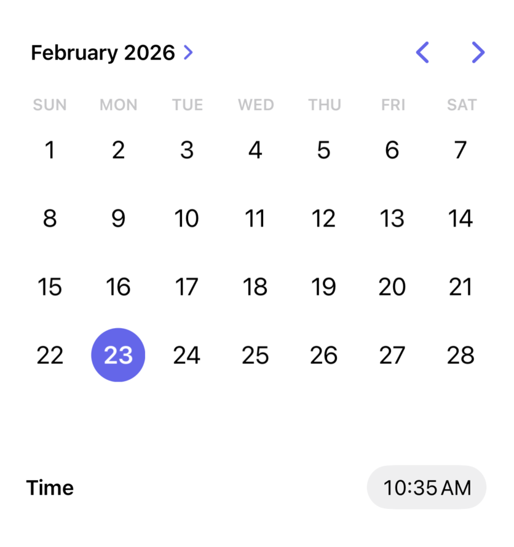

Styles: `compact` (default), `graphical`, `wheel`.

Display components: `date`, `time`, `datetime`.

Values are stored as ISO 8601 strings.

## Slider

Range selection.

```yaml
- component: slider
  stateKey: volume
  min: 0
  max: 100
  step: 5
```

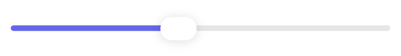

## Stepper

Increment/decrement control.

```yaml
- component: stepper
  label: "{{ 'Quantity: ' .. tostring(state.qty) }}"
  stateKey: qty
  min: 1
  max: 99
  step: 1
```

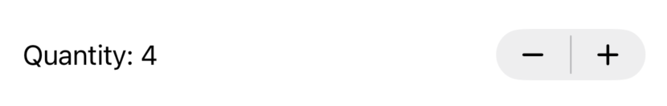

## List

Dynamic scrollable list with Lua render functions.

```yaml
- component: list
  items: "state.contacts"
  direction: vertical    # or horizontal for a carousel
  style:
    spacing: 8
    padding: 16
  render: |
    local item = state._current_item
    return {
      component = "stack",
      direction = "horizontal",
      style = { spacing = 12, padding = 12, backgroundColor = theme.surface, borderRadius = 12 },
      children = {
        { component = "image", src = item.avatar or "",
          style = { width = 40, height = 40, borderRadius = 20, contentMode = "fill" } },
        { component = "stack", direction = "vertical", style = { spacing = 2 },
          children = {
            { component = "text", text = item.name or "", style = { fontSize = 16, fontWeight = "semibold" } },
            { component = "text", text = item.email or "", style = { fontSize = 13, color = theme.textSecondary } }
          }
        }
      }
    }
```


Inside render functions, `state._current_item` is the item and `state._current_index` is the 1-based index.

## Grid

Multi-column adaptive grid.

```yaml
- component: grid
  items: "state.photos"
  columns: 3
  style:
    spacing: 4
    padding: 4
  render: |
    local item = state._current_item
    return {
      component = "image",
      src = item.url or "",
      style = { aspectRatio = 1, borderRadius = 4, contentMode = "fill" }
    }
```

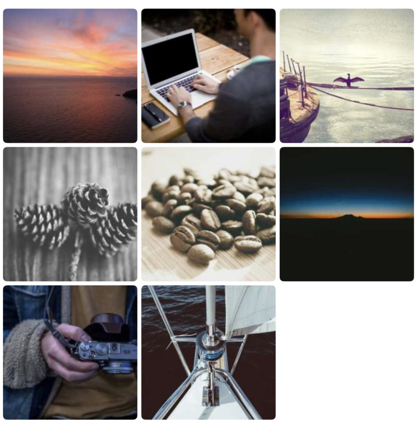

## Form

Native grouped form container. Best for settings and preference screens.

```yaml
- component: form
  formStyle: grouped
  children:
    - component: section
      label: Account
      children:
        - component: toggle
          label: Notifications
          stateKey: notifications
        - component: picker
          label: Language
          stateKey: language
          options:
            - { label: English, value: en }
            - { label: Spanish, value: es }
    - component: section
      label: About
      children:
        - component: link
          label: Privacy Policy
          url: "https://example.com/privacy"
```

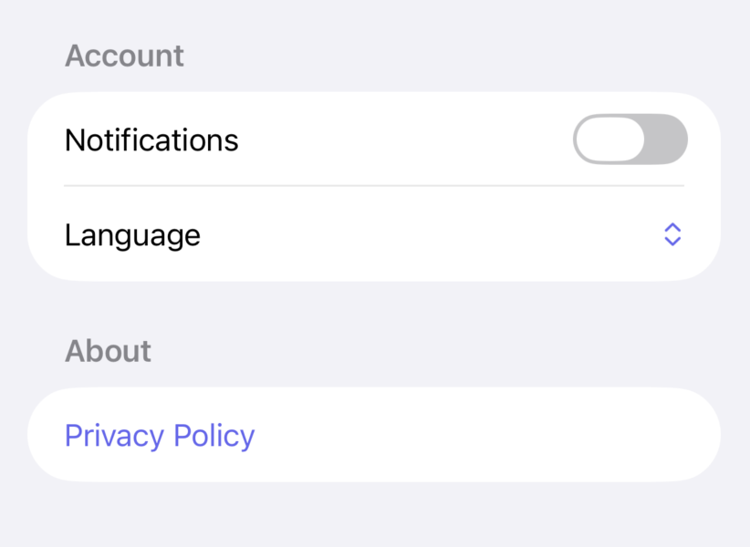

You can also use `wrapper: form` on the screen itself instead of nesting a form component.

## Section

Groups content with an optional header and footer. Works both inside forms (native grouped style) and standalone.

```yaml
- component: section
  label: Recent
  footer: Updated 5 minutes ago
  children:
    - component: text
      text: Item 1
    - component: text
      text: Item 2
```

For rich headers, use `header` (component array) instead of `label` (string):

```yaml
- component: section
  header:
    - component: stack
      direction: horizontal
      children:
        - component: text
          text: Settings
          style: { fontWeight: bold }
        - component: spacer
        - component: button
          label: Reset
          onTap: "resetSettings()"
  children:
    # ...
```

## Chart

Data visualization with Swift Charts. Supports bar, line, area, point, rule, rectangle, and sector (pie/donut) marks.

```yaml
# Bar chart
- component: chart
  items: "state.revenue"
  marks:
    - type: bar
      xKey: month
      yKey: amount
  style:
    height: 250

# Line chart with interpolation
- component: chart
  items: "state.temps"
  marks:
    - type: line
      xKey: date
      yKey: temp
      groupKey: city
      interpolation: catmullRom
  style:
    height: 250

# Donut chart
- component: chart
  items: "state.categories"
  marks:
    - type: sector
      angleKey: count
      groupKey: name
      innerRadius: 0.6
      angularInset: 2
  style:
    height: 250
```

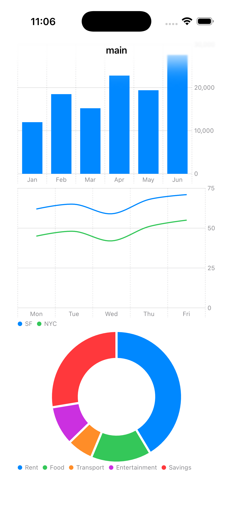

Chart data comes from Lua arrays of tables. Prepare data in `onMount`, reference via `items`.

## Menu

Dropdown menu triggered by a button.

```yaml
- component: menu
  label: Actions
  systemImage: ellipsis.circle
  children:
    - component: button
      label: Edit
      systemImage: pencil
      onTap: "melody.navigate('/edit')"
    - component: button
      label: Share
      systemImage: square.and.arrow.up
      onTap: "shareItem()"
    - component: button
      label: Delete
      systemImage: trash
      onTap: "confirmDelete()"
```

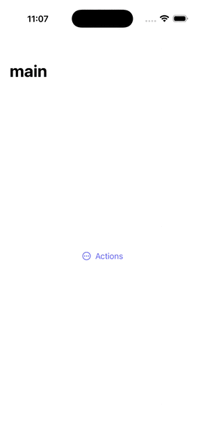

## Link

Opens a URL in the system browser.

```yaml
- component: link
  label: View Documentation
  url: "https://example.com/docs"
  systemImage: safari
  style:
    color: "theme.primary"
```

## Disclosure

Expandable/collapsible section.

```yaml
- component: disclosure
  label: Advanced Settings
  children:
    - component: toggle
      label: Debug Mode
      stateKey: debugMode
    - component: slider
      stateKey: cacheSize
      min: 10
      max: 500
```

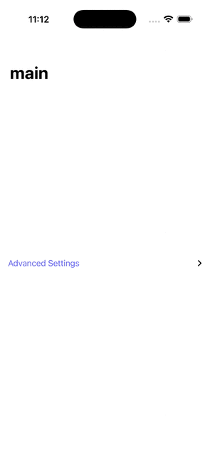

## Progress

Determinate or indeterminate progress indicator.

```yaml
# Indeterminate spinner
- component: activity
  visible: "{{ state.loading }}"

# Determinate progress bar
- component: progress
  value: "{{ tostring(state.progress) }}"
  label: "{{ tostring(math.floor(state.progress * 100)) .. '%' }}"
```

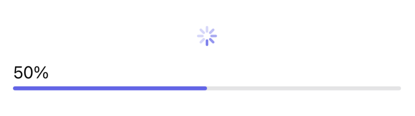

## Spacer

Flexible space that fills available room in a stack.

```yaml
- component: stack
  direction: horizontal
  children:
    - component: text
      text: Left
    - component: spacer
    - component: text
      text: Right
```

## Divider

Visual separator line.

```yaml
- component: divider
```

## State Provider

Scoped local state for self-contained interactive widgets. Children use `scope.key` instead of `state.key`:

```yaml
- component: state_provider
  localState:
    expanded: false
  children:
    - component: button
      label: "{{ scope.expanded and 'Hide' or 'Show' }}"
      onTap: "scope.expanded = not scope.expanded"
    - component: text
      visible: "{{ scope.expanded }}"
      text: Now you see me
```

## Custom Components

Define reusable templates:

```yaml
components:
  Badge:
    props:
      label: ""
      color: "theme.primary"
    body:
      - component: text
        text: "{{ props.label }}"
        style:
          fontSize: 12
          fontWeight: semibold
          color: "{{ props.color }}"
          paddingHorizontal: 10
          paddingVertical: 4
          borderRadius: 100
```

Use like any built-in component:

```yaml
- component: Badge
  props:
    label: "{{ state.status }}"
    color: "theme.success"
```
