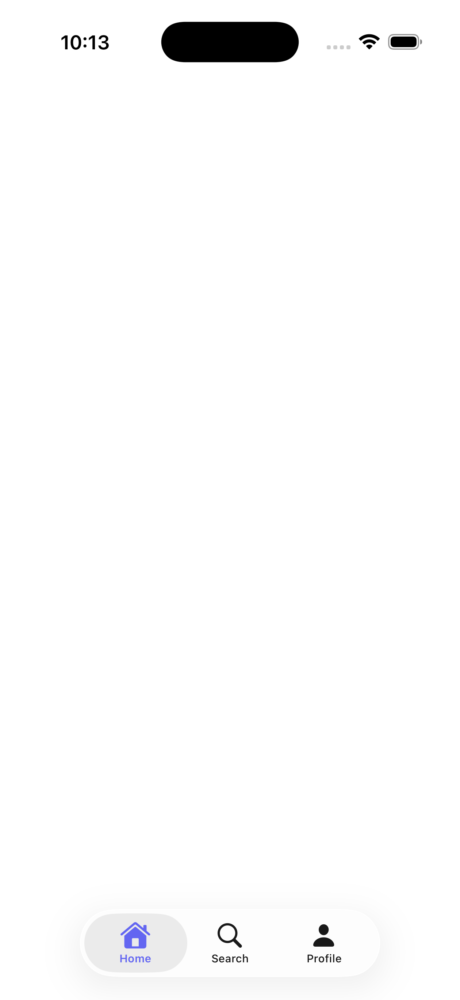
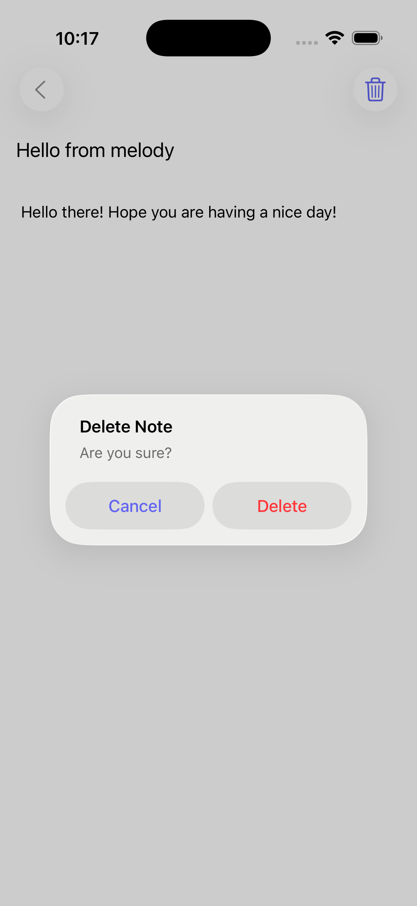

# Navigation

Melody uses path-based routing. Each screen has a unique path, and you navigate between them with Lua.

## Pushing screens

```lua
melody.navigate("/profile/123")
melody.navigate("/detail", { id = 42 })  -- with props
```

Props are available as `props.key` on the destination screen.

## Going back

```lua
melody.goBack()
```

The OS back button works automatically — don't add a manual one.

## Replacing the stack

```lua
melody.replace("/home")
```

This replaces the entire navigation stack. Useful for post-login redirects or switching between auth flows.

## Route params

Dynamic segments in paths use the `:param` syntax:

```yaml
screens:
  - id: profile
    path: /profile/:id
    onMount: |
      local userId = params.id  -- always a string
      local res = melody.fetch("https://api.example.com/user/" .. userId)
```

Params are always strings. Use `tonumber()` if you need a number.

## Tabs

A screen with `tabs` instead of `body` becomes a tab container:

```yaml
screens:
  - id: main
    path: /
    tabStyle: sidebarAdaptable
    tabs:
      - id: home
        title: Home
        icon: house.fill
        screen: /home
      - id: search
        title: Search
        icon: magnifyingglass
        screen: /search
      - id: profile
        title: Profile
        icon: person.fill
        screen: /profile
```



Each tab gets its own navigation stack — pushing within a tab doesn't affect others.

```lua
melody.switchTab("search")  -- switch to a tab programmatically
```

### Tab options

| Field | What it does |
|-------|-------------|
| `id` | Unique tab identifier |
| `title` | Tab bar label |
| `icon` | SF Symbol name |
| `screen` | Root screen path for the tab |
| `platforms` | Platform filter: `"ios"`, `"macos"`, `"desktop"` (macOS + iPad) |
| `group` | Sidebar section name (for `sidebarAdaptable`) |
| `visible` | Lua expression for dynamic visibility |

### Tab style

Set `tabStyle: sidebarAdaptable` on the tab screen for a sidebar on iPad/Mac that collapses to a tab bar on iPhone.

### Navigation within tabs

```lua
melody.navigate("/detail/123")         -- push within current tab
melody.goBack()                        -- pop within current tab
melody.replace("/login")               -- global — resets everything (breaks out of tabs)
melody.replace("/home", { local = true }) -- tab-only — replaces just this tab's stack
```

## Sheets

Present a screen as a modal sheet:

```lua
melody.sheet("/edit-profile")
melody.sheet("/filter", { detent = "medium" })
melody.sheet("/onboarding", { style = "fullscreen" })
```

Dismiss from inside the sheet:

```lua
melody.dismiss()
```

The `detent` option controls the initial height: `"medium"` for a half sheet (draggable to full), `"large"` (default) for full height.

## Alerts

Native alert dialogs:

```lua
-- Simple
melody.alert("Done!", "Your changes have been saved.")

-- With actions
melody.alert("Delete?", "This can't be undone.", {
  { title = "Cancel", style = "cancel" },
  { title = "Delete", style = "destructive", onTap = "deleteItem()" }
})
```



If you don't provide buttons, a single "OK" button is added automatically.

## Toolbar

Add buttons to the navigation bar:

```yaml
toolbar:
  - component: button
    systemImage: plus
    onTap: "melody.sheet('/new')"
  - component: spacer
  - component: button
    label: Edit
    onTap: "state.editing = not state.editing"
```

Items before `spacer` go on the leading side, items after go trailing.

Menus work in the toolbar too:

```yaml
toolbar:
  - component: menu
    systemImage: ellipsis.circle
    children:
      - component: button
        label: Share
        systemImage: square.and.arrow.up
        onTap: "shareItem()"
      - component: button
        label: Delete
        systemImage: trash
        onTap: "confirmDelete()"
```

## Search

Add a search bar to any screen:

```yaml
search:
  stateKey: query
  prompt: Search notes...
  onSubmit: |
    local res = melody.fetch("https://api.example.com/search?q=" .. urlEncode(state.query))
    state.results = res.data
```

The search text is bound to `state.query` and updates as the user types. `onSubmit` fires when they press Search on the keyboard.

## Title menu

Add a dropdown menu to the screen title (tap the title to reveal):

```yaml
titleDisplayMode: inline # applies to iOS only
titleMenu:
  - component: button
    label: All Notes
    systemImage: note.text
    onTap: "state.filter = 'all'"
  - component: button
    label: Favorites
    systemImage: star.fill
    onTap: "state.filter = 'favorites'"
```


Works best with `titleDisplayMode: inline`.
