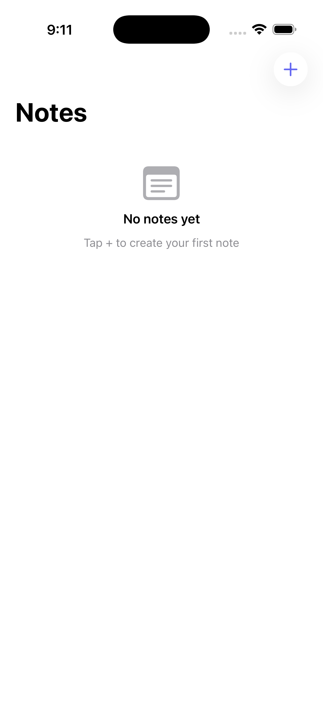
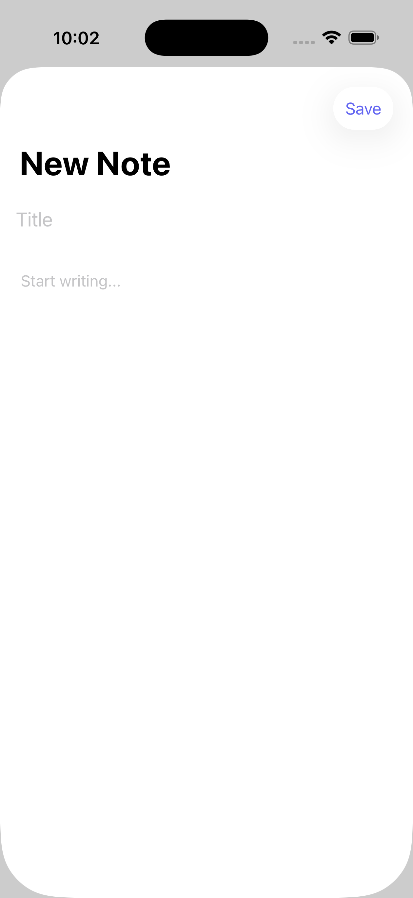
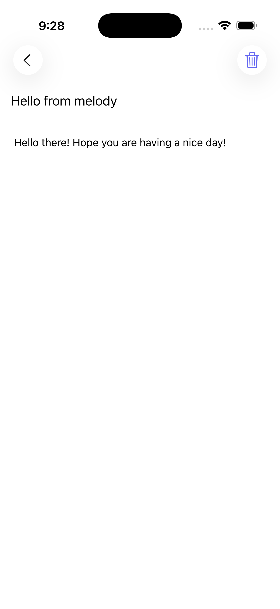
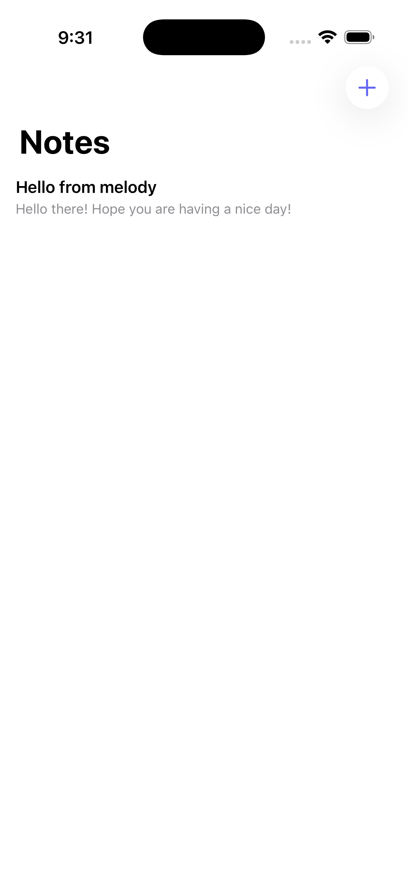

# Tutorial: Build a Notes App

We're going to build a notes app from scratch. By the end you'll have a tabbed app with a notes list, a detail screen, persistent storage, and pull-to-refresh — all in one YAML file.


## 1. Start fresh

```bash
melody create Notes
cd Notes
```

Open `app.yaml` and replace everything with:

```yaml
app:
  name: Notes
  id: com.melody.notes
  theme:
    primary: "#6366f1"
    secondary: "#a855f7"
    background: "#f2f2f7"
    colors:
      surface: "#ffffff"
      textPrimary: "#000000"
      textSecondary: "#8e8e93"
      textTertiary: "#aeaeb2"
      danger: "#ff3b30"
    dark:
      background: "#000000"
      colors:
        surface: "#1c1c1e"
        textPrimary: "#ffffff"
        textSecondary: "#8e8e93"
        textTertiary: "#636366"

screens: []
```

We've got a theme and an empty screens array. Let's fill it in.

## 2. The notes list

Add a home screen that loads notes from persistent storage:

```yaml
screens:
  - id: home
    path: /
    title: Notes
    titleDisplayMode: large
    wrapper: scroll
    state:
      notes: null

    onMount: |
      state.notes = melody.storeGet("notes") or {}

    toolbar:
      - component: button
        systemImage: plus
        onTap: "melody.sheet('/new')"

    body:
      - component: stack
        visible: "{{ state.notes ~= nil and #state.notes == 0 }}"
        direction: vertical
        style:
          spacing: 12
          padding: 40
          alignment: center
        children:
          - component: image
            systemImage: note.text
            style:
              width: 48
              height: 48
              color: "theme.textTertiary"
          - component: text
            text: No notes yet
            style:
              fontSize: 17
              fontWeight: semibold
              color: "theme.textPrimary"
              alignment: center
          - component: text
            text: Tap + to create your first note
            style:
              fontSize: 15
              color: "theme.textSecondary"
              alignment: center

      - component: list
        visible: "{{ state.notes ~= nil and #state.notes > 0 }}"
        items: "state.notes"
        style:
          spacing: 8
          padding: 16
        render: |
          local item = state._current_item
          local preview = string.sub(item.body or "", 1, 80)
          if #(item.body or "") > 80 then preview = preview .. "..." end
          return {
            component = "stack",
            direction = "vertical",
            onTap = "melody.navigate('/note/' .. tostring(" .. tostring(state._current_index + 1) .. "))",
            style = {
              paddingHorizontal = 16,
          	  paddingVertical = 8,
              backgroundColor = theme.surface,
              borderRadius = 12,
              spacing = 4,
          	  alignment = “leading",
          	  maxWidth = “full"
            },
            children = {
              { component = "text", text = item.title or "Untitled",
                style = { fontSize = 17, fontWeight = "semibold", color = theme.textPrimary } },
              { component = "text", text = preview,
                style = { fontSize = 14, color = theme.textSecondary, lineLimit = 2 } }
            }
          }
```



A few things to notice:
- `wrapper: scroll` makes the screen scrollable
- `toolbar` adds a + button in the nav bar
- The empty state shows when there are no notes
- The `list` component uses a Lua render function to build each row

## 3. The new note sheet

Add a screen for creating notes. This gets presented as a sheet:

```yaml
  - id: new-note
    path: /new
    title: New Note
    state:
      title: ""
      body: ""

    toolbar:
      - component: button
        label: Save
        onTap: |
          if state.title == "" then
            melody.alert("Missing title", "Give your note a title before saving.")
            return
          end
          local notes = melody.storeGet("notes") or {}
          table.insert(notes, 1, {
            title = state.title,
            body = state.body,
            date = os.time()
          })
          melody.storeSave("notes", notes)
          melody.emit("notesChanged")
          melody.dismiss()

    body:
      - component: input
        placeholder: Title
        stateKey: title
        style:
          fontSize: 20
          fontWeight: semibold
          padding: 16

      - component: input
        placeholder: Start writing...
        inputType: textarea
        stateKey: body
        style:
          padding: 16
          minHeight: 200
```



Key patterns here:
- `melody.storeSave()` persists the notes array to disk
- `melody.emit("notesChanged")` tells other screens to refresh
- `melody.dismiss()` closes the sheet

## 4. Listen for changes

Back on the home screen, subscribe to the event so the list updates after saving:

Add this to the home screen's `onMount`:

```yaml
    onMount: |
      state.notes = melody.storeGet("notes") or {}
      melody.on("notesChanged", function()
        state.notes = melody.storeGet("notes") or {}
      end)
```

## 5. The detail screen

Add a screen to view and edit a note:

```yaml
  - id: note-detail
    path: /note/:index
    title: ""
    state:
      note: null
      title: ""
      body: ""

    onMount: |
      local notes = melody.storeGet("notes") or {}
      local idx = tonumber(params.index) or 1
      local note = notes[idx]
      if note then
        state.note = note
        state.title = note.title or ""
        state.body = note.body or ""
      end

    toolbar:
      - component: button
        systemImage: trash
        onTap: |
          melody.alert("Delete Note", "Are you sure?", {
            { title = "Cancel", style = "cancel" },
            { title = "Delete", style = "destructive", onTap = [[
              local notes = melody.storeGet("notes") or {}
              local idx = tonumber(params.index) or 1
              table.remove(notes, idx)
              melody.storeSave("notes", notes)
              melody.emit("notesChanged")
              melody.goBack()
            ]] }
          })

    body:
      - component: input
        placeholder: Title
        value: "{{ state.title }}"
        stateKey: title
        onChanged: |
          local notes = melody.storeGet("notes") or {}
          local idx = tonumber(params.index) or 1
          if notes[idx] then
            notes[idx].title = value
            melody.storeSave("notes", notes)
          end
        style:
          fontSize: 20
          fontWeight: semibold
          padding: 16

      - component: input
        placeholder: Start writing...
        inputType: textarea
        value: "{{ state.body }}"
        stateKey: body
        onChanged: |
          local notes = melody.storeGet("notes") or {}
          local idx = tonumber(params.index) or 1
          if notes[idx] then
            notes[idx].body = value
            melody.storeSave("notes", notes)
          end
        style:
          padding: 16
          minHeight: 300
```



The detail screen:
- Uses `:index` route param to find the note
- Auto-saves on every edit via `onChanged`
- Has a delete button with a destructive confirmation alert

## 6. Add pull-to-refresh

On the home screen, add `onRefresh` so users can pull down to reload (for when we add api calls):

```yaml
    onRefresh: |
      state.notes = melody.storeGet("notes") or {}
```

## 7. Run it

```bash
melody dev
```




You've got a fully functional notes app with:
- A scrollable list with empty state handling
- Sheet-based note creation
- Inline editing with auto-save
- Persistent storage across launches
- Pull-to-refresh
- Delete with confirmation
- Cross-screen event communication

## What's next

- Add a search bar with `search: { stateKey: query, prompt: "Search notes" }`
- Add tabs to separate notes and favorites
- Add context menus for quick actions (long-press on a note row)
- Split into multiple YAML files using the `screens/` directory

Check out the [Components Guide](./guides/components.md) for more building blocks.
